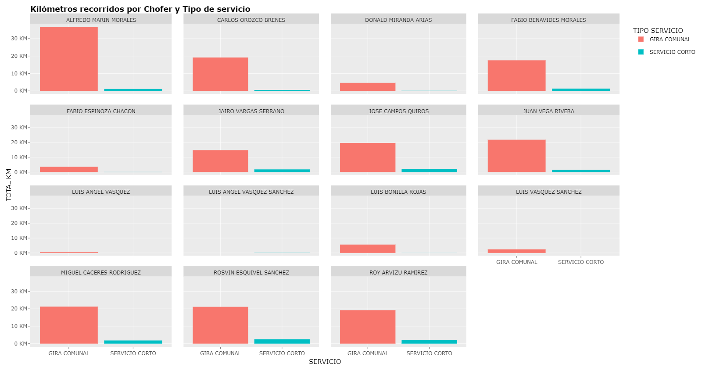

El propósito de este proyecto es realizar un análisis exploratorio (EDA) de un conjunto de datos de interés. Para ello se deberá publicar una página Web en donde se describa el EDA realizado, incorporando una serie de visualizaciones que describen el comportamiento de los datos y los patrones identificados en los mismos.

Además, cabe recalcar que los datos utilizados en este proyecto fueron los del archivo denominado **“Uso_Transporte_MAYO_2018-JUNIO_2020”**.

```{r echo=FALSE, message=FALSE, warning=FALSE}

library(stringdist)
library(ggplot2)
library(lubridate)
library(scales)
library(RColorBrewer)
library("rstudioapi")    
library(patchwork)
library(tidyverse)
library(plotly)
library(ggiraph)
library(patchwork)

setwd(dirname(getActiveDocumentContext()$path))

data <- read.csv("Uso_Transporte_MAYO_2018-JUNIO_2020.csv", header = FALSE, sep = ";", stringsAsFactors = FALSE, skip =2, fileEncoding = "ISO-8859-1")

# Split each row based on multiple semicolons (;;)
data <- data %>%
  mutate(row_data = strsplit(as.character(V1), ";;")) %>%
  unnest(row_data) %>%
  mutate(row_data = strsplit(row_data, ";")) %>%
  unnest(row_data)
# Separate the row_data into separate columns
data <- data %>%
  separate(row_data, into = paste0("Category", 1:9), sep = ";", fill="right")
# Remove the first and last columns
data <- data %>%
  select(-1, -ncol(data)) %>%
  select(where(~ any(!is.na(.))))
# Remove the 10th column
data <- data[, -10]
# Get the names from the first row
new_names <- unlist(data[1, ])
# Rename the columns
data <- setNames(data, new_names)
# Filter rows based on conditions using if_any and if_all
data <- data %>%
  filter(if_any(everything(), ~ !(.x %in% names(data))),
         if_all(everything(), ~ !(.x == "?")))
# Remove "?" from all strings in the data frame
data <- data %>% mutate(across(everything(), ~str_replace_all(., "[-|!?]", " ")))
data <- data %>% mutate(across(everything(), ~str_replace_all(., "[,]", "")))
# Remove trailing spaces using if_any and if_all
data <- data %>%
  mutate(across(where(~any(str_detect(., "\\s"))), str_trim), 
         across(where(~all(str_detect(., "\\s"))), str_trim))
# Capitalize
data <- data %>%
  mutate(across(everything(), toupper))
# Function to replace accent marks
remove_accents <- function(string) {
  chartr("áéíóúüñÁÉÍÓÚÜ", "aeiouunAEIOUU", string)
}
# Apply the function to all columns
data <- data %>%
  mutate(across(everything(), remove_accents))
# Normalize strings by removing diacritics (accent marks)
normalize_string <- function(string) {
  return(stri_trans_general(string, "Latin-ASCII"))
}

# Convert to numeric
data$`TOTAL KM` <- as.numeric(as.character(data$`TOTAL KM`))
data$COMBUSTIBLE <- as.numeric(as.character(data$COMBUSTIBLE))

```

```{r echo=FALSE, message=FALSE, warning=FALSE}

#--------------------------------------------------------------------------------#

# List of words for grouping
Provincias <- c("SAN JOSE", "GUANACASTE", "PUNTARENAS", "LIMON" , "CARTAGO" ,"HEREDIA", "ALAJUELA")

Cantones <- c("SAN JOSE", "SAN MARCOS", "SAN RAMON", "LIMON", "SARAQUIQUI", "MORA", "SANTA CRUZ", "LIBERIA", 
              "NICOYA", "ALAJUELA", "SAN RAFAEL", "SAN ISIDRO", "NARANJO", "QUESADA", "PALMARES", "PUNTARENAS", "GUACIMO", 
              "SANTO DOMINGO", "COTO BRUS", "MATINA", "GUAPILES", "CARIARI", "DESAMPARADOS", "LA URUCA", "SIQUIRRES", "SAN VICENTE", 
              "BUENOS AIRES", "POAS", "CURRIDABAT", "ESPARZA", "SAN PABLO", "PURRAL", "TURRIALBA", "CANAS", "DESAMPARADOS", "SAN JUAN", 
              "HORQUETAS", "RITA", "SAN PEDRO", "SAN RAFAEL ABAJO", "CARTAGO", "GUADALUPE", "SAN ISIDRO", "PARAISO", "SARTALILLO", 
              "AGUAS ZARCAS", "SAN FRANCISCO", "PUERTO VIEJO", "GUACIMA", "QUEPOS", "BAGACES", "SAN JUAN DE DIOS", "HEREDIA", "ZAPOTE", 
              "ABANGARITOS", "COLON", "PITAL", "ROXANA", "SAN ISIDRO", "BATAN", "UPALA", "PARRITA", "POZOS", "FORTUNA", "SAN RAFAEL ARRIBA", 
              "FLORENCIA", "SARDINAL", "GRECIA", "SAN VITO", "COPALCHI", "LOS CHILES", "SANTA ANA", "MATINILLA", "PUERTO JIMENEZ", "SANTIAGO", 
              "ALAJUELITA", "ESCAZU", "PATARRA", "SIXAOLA", "JACO", "SAN JOSECITO", "GOLFITO", "NANDAYURE", "RIO CUARTO", "SABALITO", "RIO SEGUNDO", 
              "PUENTE DE PIEDRA", "LA VIRGEN", "SAN JOSECITO", "JIMENEZ", "SAN MARCOS", "SAN ANTONIO", "DULCE NOMBRE DE JESUS", "OROTINA", "CANOAS", 
              "TRES RIOS", "CARRILLOS", "SAN IGNACIO", "PIEDADES NORTE", "PIEDADES", "TACARES", "DULCE NOMBRE", "TURRUCARES", "SAN PEDRO", "ATENAS", 
              "BUENOS AIRES", "SANTA LUCIA", "BRIBRI", "SARCHI", "SAN RAFAEL", "TOBOSI", "JUAN VINAS", "VUELTA DE JORCO", "GENERAL VIEJO", "SAN JUAN GRANDE", 
              "SAN JERONIMO", "AQUIARES", "SAN GABRIEL", "CINCO ESQUINAS", "COYOLAR", "PACAYAS", "SAN JOSE DE LA MONTANA", "QUEBRADILLAS", "SARCHI SUR", 
              "TIERRA BLANCA", "BARVA", "TUCURRIQUE", "MACACONA", "SAN PABLO", "SAN MIGUEL OESTE", "CIRRI", "ZARCERO", "LLANO GRANDE", "SALITRAL", "SAN CRISTOBAL SUR", 
              "SAN ANTONIO", "FRAILES", "CIPRESES", "SAN JERONIMO", "MATA DE PLATANO", "SAN CARLOS", "SABANA", "PEREZ ZELEDON", "GUANACASTE", "CIUDAD NEILY", "POCOCI", "PAVAS"
)

Instituciones <- c("TEATRO NACIONAL", "AEROPUERTO", "AREA METROPOLITANA", "ASAMBLEA LEGISLATIVA", "BANCO", "CANAL 7", "CASA PRESIDENCIAL|PRESIDENCIA DE LA REPUBLICA", 
                   "CCSS", "CENTRO DE CONVENCIONES", "CLUB UNION", "COLEGIO DE ABOGADOS", "COLEGIO DE INGENIEROS", "CONTRALORIA", "COUNTRY CLUB", "CRHOY", 
                   "DEFENSORIA DE LOS HABITANTES", "DIARIO EXTRA", "DINADECO", "IMAS", "EMBAJADA", "HOTEL", "ICE", "ICODER", "INCOFER", "ICT", "INA", "INDER", "INS","ACUEDUCTOS Y ALCANTARILLADOS|AYA|A Y A", 
                   "MINISTERIO DE EDUCACION|MEP", "ESTADIO NACIONAL", "FISCALIA GENERAL","MINISTERIO DE HACIENDA", "MINISTERIO DE OBRAS PUBLICAS|MOPT", "MINISTERIO DE TRABAJO", "MINISTERIO DE AMBIENTE", "MINISTERIO DE SALUD", 
                   "MUNICIPALIDAD", "MINISTERIO DE AGRICULTURA Y GANADERIA|MINISTERIO AGRICULTURA Y GANADERIA", "MINISTERIO DE SEGURIDAD","MINISTERIO DE ECONOMIA", "COOPEANDE", "INFOCOOP","RADIO", "REGISTRO NACIONAL", 
                   "SALA CONSTITUCIONAL", "TEATRO NACIONAL", "UNIVERSIDAD"
)

Destino_Mix <- c(Cantones,Instituciones)

```

```{r echo=FALSE, message=FALSE, warning=FALSE}
#--------------------------------------------------------------------------------#
# Function to check if any word in group_words is present in the value
group_destinations_cantones <- function(value) {
  matched_words <- Destino_Mix[sapply(Destino_Mix, function(word) grepl(word, value, ignore.case = TRUE))]
  if (length(matched_words) > 0) {
    return(matched_words[1])  # Return the first matched word as the group
  } else {
    return("Other")  # Return "Other" if no match found
  }
}

# Apply the function to create a new column for grouping
data <- data %>%
  mutate(Destino_Group = sapply(DESTINO, group_destinations_cantones))

# Create a summary dataframe with counts of each group
group_counts <- data %>%
  group_by(Destino_Group) %>%
  summarise(count = n())

#--------------------------------------------------------------------------------#

```

## Gráficas Unidimensionales

A continuación, se realizaron 3 gráficas: **Tipo de Servicio, Destino - Top 10 y Diputado(a) - Top 10**.

```{r, echo=FALSE}
##################### UNIDIMENSIONALES #########################################

#------------------TIPO DE SERVICIO GENERAL----------------------------------#

data_counts <- data %>%
  count(`TIPO SERVICIO`)

# Rename columns for clarity
colnames(data_counts) <- c("Servicio", "Cantidad")

# Create the ggplot object
servicio_plot <- ggplot(data_counts, aes(x = Servicio, y = Cantidad, fill = Servicio )) +
  geom_bar(stat = "identity") +
  labs(
    title = "<b>Tipos de Servicios</b>",  # Bold title
    x = "Servicio",  # X-axis label
    y = "Cantidad"   # Y-axis label
  ) +
  theme_minimal()

# Convert ggplot to plotly
servicio_plotly <- ggplotly(servicio_plot)

# Print the interactive plots
servicio_plotly

```

```{r, echo=FALSE}
#----------------DESTINOS GENERAL - TOP 10-------------------------------------#

# Get the top 10 destination groups
top_10_groups <- group_counts %>%
  top_n(10, wt = count) %>%
  mutate(Destino_Group = fct_reorder(Destino_Group, count))

# Create the ggplot object
destino <- ggplot(top_10_groups, aes(x = count, y = Destino_Group, fill = Destino_Group)) +
  geom_bar(stat = "identity") +
  labs(x = "Visitas frecuentadas", y = "Destino", title = "<b>Top 10 destinos mas frecuentados</b>") +
  theme_minimal() +
  theme(axis.text.y = element_text(angle = 45, hjust = 1))

# Replace "other" with your desired text on the Y-axis
destino <- destino + scale_y_discrete(labels = function(x) ifelse(x == "Other", "OTROS", x))

# Convert ggplot to plotly
destino_plotly <- ggplotly(destino)

destino_plotly <- destino_plotly %>%
  layout(
    legend = list(orientation = "h", y = -0.15),  # Position legend below the plot
    yaxis = list(tickangle = 45)
  )

destino_plotly
```

```{r,echo=FALSE}
#---------------------DIPUTADO/A GENERAL - TOP 10-----------------------------#
# Count each deputies
diputados_counts <- data %>%
  count(`DIPUTADO (A)`)

# Rename columns for clarity
colnames(diputados_counts) <- c("Diputados", "Viajes")

# Sort the dataframe by the travel column in descending order
diputados_counts <- diputados_counts %>%
  arrange(desc(Viajes))

# Take top 10 of deputies whith the most travels
top_10_diputados <- diputados_counts[1:10, ]

# Create the ggplot object
diputado_plot <- ggplot(top_10_diputados, aes(x = Viajes, y = reorder(Diputados, Viajes) , fill = Diputados)) +
  geom_bar(stat = "identity") +
  labs(
    title = "<b>Uso de Transporte por Diputado - TOP 10</b>",  # Bold title
    x = "CANTIDAD DE VIAJES",  # X-axis label
    y = '', # Y-axis label
    fill = "DIPUTADOS"   # fill-axis label
  ) +
  theme_minimal()

# Convert ggplot to plotly
diputado_plotly <- ggplotly(diputado_plot, tooltip = c("Viajes"))  # Customize label

diputado_plotly

```

## Gráficas Bidimensionales

A continuación, se realizaron 2 gráficas: **Total KM vs Chofer y Combustible vs Destino**

```{r,echo=FALSE}
#------------------------Total KM vs Chofer----------------------------------------------#

# Create the ggplot object 
totalkm_chofer_plot <-ggplot(data, aes(x = `TOTAL KM`, y = `CHOFER`)) +
  geom_point() +
  labs(
    title = "<b>Total KM vs. Chofer<b>",  # Bold title
    x = "Total de Kilómetros",       # X-axis label
    y = "Chofer"                     # Y-axis label
  ) +
  theme_minimal()

# Convert ggplot to plotly
totalkm_chofer_plotly <- ggplotly(totalkm_chofer_plot)

# Print the interactive plot
totalkm_chofer_plotly

```

```{r, echo=FALSE}
#-------------------------Combustible vs Destino----------------------------------------------#

# Filter the top 10 destinations
top_destinations <- data %>%
  group_by(DESTINO) %>%
  summarise(total_combustible = sum(COMBUSTIBLE)) %>%
  top_n(10, total_combustible)

comb_dest <- ggplot(top_destinations, aes(x = DESTINO, y = total_combustible, fill = DESTINO)) +
  geom_bar(stat = "identity") +
  labs(title = "Top 10 Destinos vs Combustible consumido",
       x = "Destinos",
       y = "Total Combustible (colones)") +
  theme_minimal() +
  theme(axis.text.x = element_text(angle = 45, hjust = 1))+
  scale_y_continuous(labels = scales::comma)

comb_dest <- ggplotly(comb_dest)

comb_dest
```

## Gráfica Multidimensional

```{r echo=FALSE, message=FALSE, warning=FALSE}

#--- DIPUTADO (A), DESTINO, CHOFER , COMBUSTIBLE, TIPO DE SERVICIO, TOTAL KM------------------------#

# Aggregate data
summary_df <- data %>%
  group_by(`DIPUTADO (A)`, DESTINO, CHOFER, COMBUSTIBLE, `TIPO SERVICIO`) %>%
  summarise(TOTAL_KM_mean = mean(`TOTAL KM`, na.rm = TRUE))

# Convert non-numeric COMBUSTIBLE values to NA
summary_df$COMBUSTIBLE <- as.numeric(as.character(summary_df$COMBUSTIBLE))

# Clean up non-numeric or problematic values
summary_df$COMBUSTIBLE[is.na(summary_df$COMBUSTIBLE) | is.infinite(summary_df$COMBUSTIBLE) | summary_df$COMBUSTIBLE < 0] <- NA

# Create interactive plot with facet_grid
p <- plot_ly(data = summary_df, x = ~`DIPUTADO (A)`, y = ~TOTAL_KM_mean, color = ~`TIPO SERVICIO`,
             type = "bar", hoverinfo = "text",
             text = ~paste("DESTINO:", DESTINO, "<br>",
                           "CHOFER:", CHOFER, "<br>",
                           "COMBUSTIBLE:", COMBUSTIBLE, "<br>",
                           "TOTAL KM Mean:", TOTAL_KM_mean)) %>%
  layout(
    barmode = "group",
    title = list(text = "<b>Kilometros recorridos por Diputado (a)</b>", font = list(size = 16)),  # Bold title
    xaxis = list(tickangle = 45, title = "<b>Diputado (a)</b>"),  # Rotate X-axis by 45 degrees
    yaxis = list(title = "<b>Total Kilometros (KM)</b>"),  # Y-axis label in bold
    colorway = brewer.pal(5, "Set2")  # Specify at least 3 colors for color palette
  )

p
```

## Faceta

```{r echo=FALSE, message=FALSE, warning=FALSE}
# -------------------------- CHOFER , TIPO DE SERVICIO, TOTAL KM -----------------------------------#
# Aggregate data
summary_faceta <- data %>%
  group_by(CHOFER, `TIPO SERVICIO`) %>%
  summarise(Total_KM = sum(`TOTAL KM`)/1000)

# Crear el gráfico de barras con facetas
faceta_plot <- ggplot(summary_faceta, aes(x = `TIPO SERVICIO`, y = Total_KM, fill = `TIPO SERVICIO`)) + 
  geom_col() +
  facet_wrap(~ CHOFER) +
  scale_y_continuous(labels = unit_format(unit = "KM")) +
  labs(
    title = "<b>Kilómetros recorridos por Chofer y Tipo de servicio<b>",
    x = "CHOFERES",
    y = "TOTAL KM"
  )

# Convert ggplot to plotly
faceta_plotly <- ggplotly(faceta_plot)

# Print the interactive plot
faceta_plotly
```

En este caso, se aporta la imagen debido a que no se logra apreciar muy bien la gráfica.



## Imagen Compuesta

```{r, echo=FALSE}
# ---------------- COMBUSTIBLE , TOTAL KM, AÑO(FECHA INICIAL) -----------------------------------#
# Aggregate data
summary_segunda_faceta <- data %>%
  select(`FECHA INICIAL`, `TOTAL KM`, COMBUSTIBLE)

# Take the year of each date
summary_segunda_faceta$YEAR <- year(dmy(summary_segunda_faceta$`FECHA INICIAL`))

# Create the ggplot object 
segunda_faceta_plot <- ggplot(summary_segunda_faceta, aes(x = COMBUSTIBLE , y = `TOTAL KM`)) +
  geom_point() +
  facet_wrap(~ YEAR, scales = "free") +
  labs(title = "Combustible vs. Total KM por año",
       x = "COMBUSTIBLE",
       y = "TOTAL KM")

# -------------------------- TIPO DE SERVICIO VS DESTINO -----------------------------------#
# Create the ggplot object 
barras_aplicadas_plot <- ggplot(data, aes(fill = `TIPO SERVICIO`)) +
  geom_bar(aes(x = `Destino_Group`), position = "stack", width = 0.7) +
  labs(
    title = "Distribución de Servicios por Destino",
    x = "DESTINO",
    y = "CANTIDAD",
    fill = "SERVICIO"
  ) +
  theme_minimal() +
  theme(axis.text.x = element_blank())

# Convert ggplot to plotly
segunda_faceta_plotly <- ggplotly(segunda_faceta_plot)
barras_aplicadas_plotly <-  ggplotly(barras_aplicadas_plot)

# Combine plots using subplots
imagen_compuesta_plot <- subplot(
  barras_aplicadas_plotly, 
  segunda_faceta_plotly, 
  nrows = 2,
  margin = 0.08
)

# Add axis labels and titles to each subchart
imagen_compuesta_plot <- imagen_compuesta_plot %>%
  layout(
    title = "Uso de Transporte",  # title
    yaxis = list(title = "CANTIDAD"), #Y-axis label of the first graph
    yaxis2 = list(title = "TOTAL KM"),  # Y-axis label of the second graph
    xaxis = list(title = "DESTINO"),  # X-axis label of the first graph
    xaxis2 = list(title = "COMBUSTIBLE")  # X-axis label of the second graph
  )

# Show interactive plot
imagen_compuesta_plot
```
